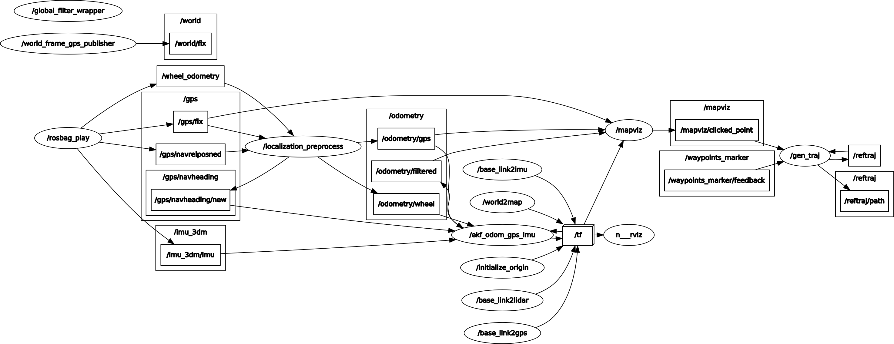
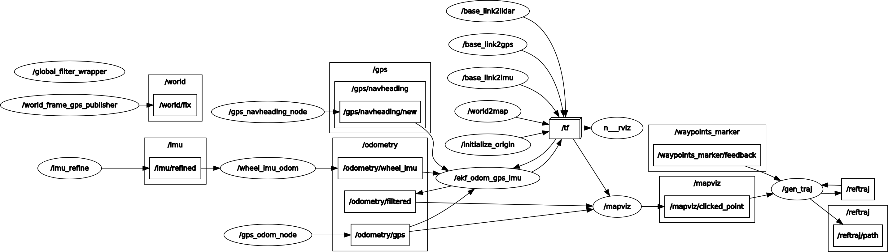

# ugv_localization

Description: customized ROS package for localization of unmanned ground vehicle, by fusing with Extended Kalman Filter from external robot_localization package. 

## Dependencies
System: ROS-Kinetic on Ubuntu 16.04. 

External ROS packages: Most of them can be installed by
```sudo apt-get install ros-kinetic-{package_name}```

*  mapviz, mapviz_plugins, tile_map
*  message_filters 
*  robot_localization
*  tf2_ros

Customized ROS packages:

*  imu_3dm_gx4
*  rampage_msgs 
*  ublox

## Download and Build

Please clone the repo into your local machine and checkout the robot_localization branch.
Then move the ugv_localization folder under /src of your local workspace.
Run the following comman to build the package 
```
catkin build ugv_localization
```

## Package Layout

### 1. Nodes ###

**C++ Nodes:**

**gps_navheading_node**: subscribes to "gps/navrelposned" topic, converts to Imu message with new covariance and publishes it to as heading measurement input of the filter.

**gps_odom_node**: subscribes to the topic of GPS lat / lon  measurement (message type is sensor_msgs/NavSatFix), converts to Odometry message with new covariance and publishes it as position measurement input of the filter.

**localization_preprocess**: integrated node which subscribes to wheel encoder, GPS lat / lon (NavSatFix) and "gps/navrelposned" topic, does all the message coversion and publishes processed message into required input topics for the filter in parallel. (Parameters for this node are in `/params/localization_preprocess.yaml` file.)

**Python Nodes:**

**gen_traj.py**: used to generate and refine trajectory by clicking points in mapviz and moving around interactive markers in Rviz. (Parameters for this node are in `/params/reftraj_gen.yaml` file.)

**global_filter_wrapper.py**: a wrapper node used to initialize robot state based on converted wheel odoemtry and GPS measurements (position + heading), and calls inside the filter to run. This wrapper node takes in three arguments - topic names for converted wheel odometry, GPS odometry, GPS heading (these are usually the output topics of localization_preprocess node). Required rosparams to set for this node include

filter_node_name: name for the inside filter node;

config_file: path of the file which includes parameters for the inside filter node (e.g. `$(find ugv_localization)/params/ekf_odom_imu_gps.yaml`). Please refer to http://docs.ros.org/melodic/api/robot_localization/html/state_estimation_nodes.html for instructions about filter parameters.

topic_out: topic name to publish the filtered odometry (default: `odometry/filtered`).

**gps_cov_handler.py**: used to re-scale GPS heading (Imu message) or position (Odometry message) measurement and reject failing data based on covariance threshold. (This node is used only for analysis purpose, currenly not for real-time usage.)

**plot_curve.py**: this node plots with matplotlib and saves them under `/figs` for analysis purpose (e.g. compare filtered and non-filtered odometry, detect mismatching of data jumps with incorrect covariance, etc).

**plot_traj.py**: this node plots the basic odometry shape with matplotlib based on individual sensor (message type can be Odometry, Imu of NavSatFix), used for early checking any sensor data inconsistency.

**traj_opt.py**: works offline to read in a .npy file which records 2D waypoints and generates the reference trajectory. (Please see the **Tools and Utilities** section below for more detailed instructions of use.)

**wheel_imu_odom.py**: used to generate and publish simple Odometry merely using wheel encoder and imu by 2D rigid motion model.

**world_frame_gps_publisher.py**: publishes the latitude and longitude of the local world frame origin. (Parameters for this node are in `/params/world_frame_origin_gps.yaml` file.)

### 2. Launch Files ###

**gen_traj.launch**: runs the **gen_traj.py** node to generate reference trajectory

**mapviz.launch**: visualize the satellite map by mapviz (config file for mapviz is `/launch/mapviz.mvc`).

**plot.launch**: runs **plot_curve.py** or **plot_traj.py** node to plot curves for analysis. Please uncomment lines in this launch file to use.

**reftraj_gen_clickedpoints.launch**: used to click waypoints in mapviz and generates or refines reference trajectory without running the filter.

**reftraj_publish.launch**: publishes a pre-generated reference trajectory (saved as a yaml file under `/traj` folder, the name of the file should be speicified by argument "traj") to /reftraj topic.

**static_tfs.launch**: publishes all required static tfs (base_link to imu, base_link to gps, base_link to lidar, world to map)

**ugv_localization.launch**: the main launch file for running the whole localization pipeline (pre-processing, initializing, ekf filtering, visalizing, trajectory generating and refining). The rqt_graph of the pipeline is shown below.



(**ugv_localization_old.launch**: an old launch file for running the whole localization pipeline which uses separate node for pre-processing instead of the integrated localization_preprocess node. The rqt_graph is shown below.)



**world_frame_gps.launch**: runs **world_frame_gps_publisher.py** node.

## Important Nodes

### 1. MapProxy Satellite Map Tile Server Setup

**Note: This step is optional and can be skipped if you want to use mapbox instead of google map for visualization in mapviz (which is the current default setting for mapviz).**

1.1. Create the MapProxy configuration folder.
```
mkdir ~/mapproxy
```
1.2. Start MapProxy server
```
sudo docker run -p 8080:8080 -d -t -v ~/mapproxy:/mapproxy danielsnider/mapproxy
```
1.3 To confirm that the map tile server is working, browse  http://127.0.0.1:8080/demo/

1.4. Switch the Source of "tile_map" in mapviz to "google map".  

### 2. UGV Localization Node

#### Launch:

```
source devel/setup.bash
roslaunch ugv_localization ugv_localization.launch data:={real/bagfile}
```

Node: you have to replace ```{real/bagfile}``` with either ```real``` (if you want to run the localizer on robot in real-time) or the filename (without extension) of pre-recorded rosbag (if you want to run the localizer with replaying a bagfile under /bag folder).

#### Params:

The ekf filter-related parameters are in `/params/ekf_odom_imu_gps.yaml`.

**Note: If you want to use the old localization setup with pre-processing nodes running separately, you should use `ugv_localization_old.launch`, and the ekf filter-related parameters are instead in `/params/ekf_odom_imu_gps_old.yaml`.**

### 3. Tools and Utilities

The message pre-processing related parameters are in `/params/localization_preprocess.yaml`. (This is used in "localization_preprocess" node, which integrates all GPS and wheel encoder message conversions into one single node.)

The ekf filter-related parameters are in `/params/ekf_odom_imu_gps.yaml`.

Reference Trajectory, as a `RefTrajAxyt` mgs, can be  clicking points and trajectory generation related parameters are in `/params/reftraj_gen.yaml` (the associated launch file is `/launch/gen_traj.launch`). To note, when the parameter "save_traj_file" is set to "None", the generated trajectory will not be saved; if it is set to "save_traj_file : traj_abc" for example, the generated trajectory will be saved to "/traj/traj_abc.yaml". Similarly, when the parameter "save_plot_file" is set to "None", the plot of generated trajectory will not be saved; if it is set to "save_plot_file : traj_abc" for example, the plot will be saved to "/plot/traj_abc.png"
(Note: for starting and stopping clicking points, you need to double-click on mapviz, however, you should not double click too fast because mapviz will respond slow.) 

**Generate trajectory from pre-recorded bag file:**

If you want to generate a trajectory from a pre-recorded bag file, you can simply run the "traj_opt.py" node without needing to use any launch files. For example, if you run like

```
rosrun ugv_localization traj_opt.py _start_time:=1592522650 _end_time:=1592522743 _wps_every_secs=2 _bagfile:=test_01 _topic:=/odometry _save_traj:=traj_abc _vel:=2 _accel:=2
```
(Node: These three parameters above are optional: save_traj, vel, accel)

It will generate a trajectory with velocity of 2 m/s and acceleration of 2 m/s^2, using the "/odometry" topic (message type: Odometry) in bag file "/bag/test_01.bag" between 1592522650 and 1592522743 (ROS time), and save it to "/traj/traj_abc.yaml". The plot of trajectory will be saved to "/traj/traj_abc.png". (To note, the waypoints are sampled every 2 seconds here, which is specified with the parameter "wps_every_secs".)

**Refine current trajectory with InteractiveMarker in Rviz:**

If you want to refine the generated trajectory by moving clicked waypoints, you should follow these steps:

1). Make sure the paramter "enable_refine" is set to True in /params/reftra_gen.yaml

2). After clicking points in mapviz, you will see a series of blue cubic markers in Rviz, located at where you clicked.

3). Move each of the cubic markers on the X-Y plane by draging the arrows around the marker.

4). After moving each marker (waypoints) to your desired locations in Rviz, you can left-click on whichever marker to re-generate trajectory. (The trajectory message will be re-published to the same topic, and its yaml file as well as its plot will be saved to the same path if you specified one.)


