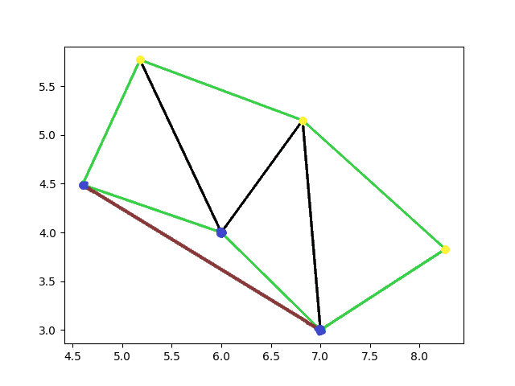
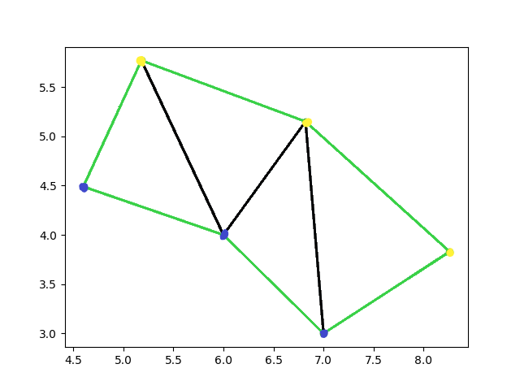

# Delauney Triangularization

## Introduction

The Delauney Triangularization is usued in order to delineate the boundaries of the track. However when creating a trianguralization we might get a "non-valid"
triangle: meaning a triangle in which one of his side gets out of the track. Look at the examples below:

All the lines are outputs of the Delauney trianglularization. 
The cones are the blue and yellow dots, the green lines represents the boundary of the track, the black lines are inner segments that will be useful for the path planning. However in one picture there is a red line: that is also an output of the Delauney trianglularization however that line is outside the track. Our code deletes that line in order to avoid the situation in which the car goes outised the track.

## Rules and Demands
 
Rules: None
 
Demands: the input of the function should be a list of dictionaries with each dictionary being of the form 
{"Label": "The colour of the cone", "Zpos": position on the vertical axis, "Ypos": position y axis , "Xpos": position x axis , "Time": time at which the signal was received}
